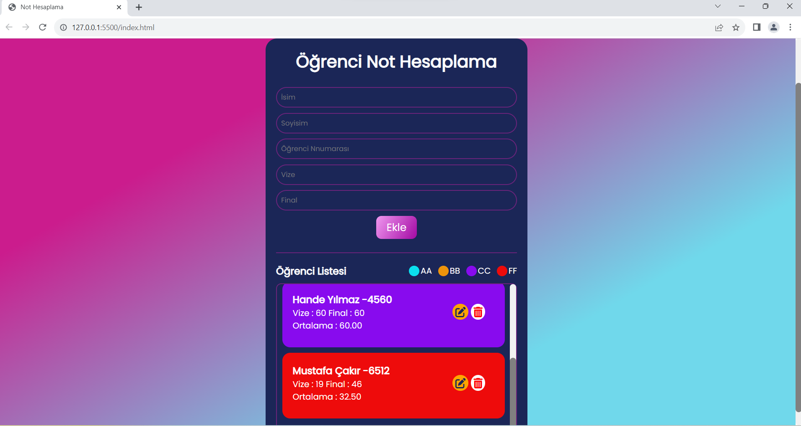

<h1>Öğrenci Not Hesaplama Projesi</h1>

Ad, soyad, numara, vize, final parametreleri girilerek 
oluşturulmuş, not ekleme/düzenleme/silme ekranıdır.

Girilen vize ve final notlarının toplamının ikiye bölümü, 
ortalamayı belirleyen işlem metodudur.

JS ile dinamizm sağlanmıştır.

<h2> Kullanılan Teknolojiler</h2>

• Javascript
• HTML 
• SCSS 
• CSS
kullanılarak oluşturulmuştur.

<h3> İşlemler </h3>

- Local Storage, getItem, setItem kullanıldı.
- DOM yapısıyla HTML öğelerine erişim uygulandı.
- Bildirimler için Toastify kütüphanesi kullanıldı.
- Delete ve edit fonksiyonları kullanıldı.
- İkonlar Font Awesome'dan alındı.

<h3>Ekran Görüntüleri</h3>

<h4> Video </h4>

<h5> GIF </h5>

